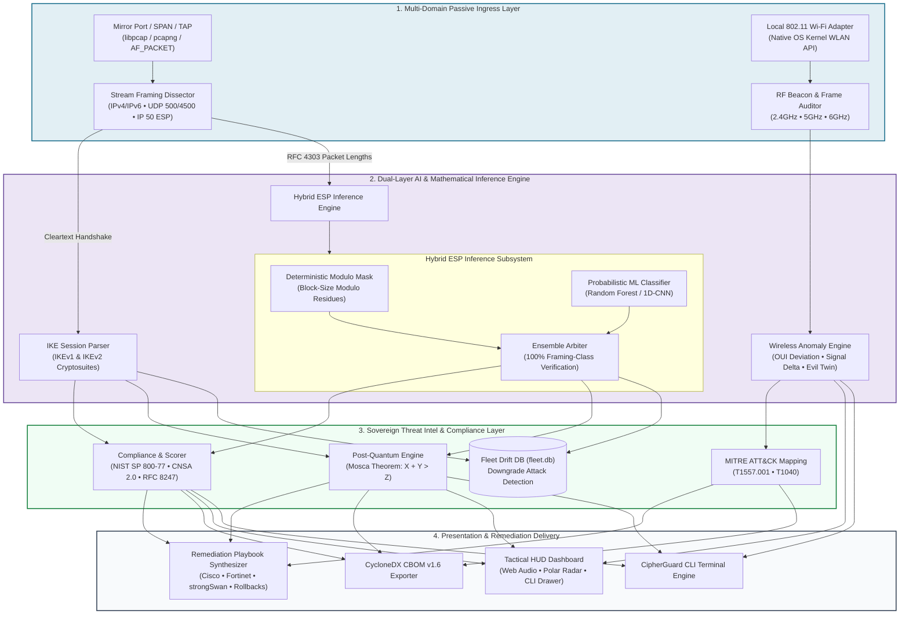

# System Architecture & Technical Specifications — CipherGuard

**System:** CipherGuard (AI-Powered Passive Protocol Analyzer & Wireless Auditor)  
**Target Standard:** SIH26160 / NTRO Defense Specifications  
**Document Version:** 1.0.0  

---

## 1. High-Level System Architecture

CipherGuard operates on a four-tier pipeline architecture designed for zero-decryption passive inspection across both physical wired TAP/SPAN ports and ambient 802.11 RF spectrometry.



---

## 2. The Epistemic Domain Model

A foundational architectural invariant in CipherGuard is the strict visual, logical, and structural separation of data by **epistemic certainty**:

```
+-------------------------------------------------------------------------------+
|                             EPISTEMIC ARCHITECTURE                            |
+------------------------------------+------------------------------------------+
|       OBSERVED DOMAIN (Teal)       |         INFERRED DOMAIN (Violet)         |
|         #1b6e8c / #e2eff4          |            #6d4e9c / #ece5f5             |
+------------------------------------+------------------------------------------+
| - Exact mathematical ground truth  | - Probabilistic AI / ML classification   |
| - Cleartext IKE protocol payloads  | - RFC 4303 packet length distributions   |
| - Unencrypted Wi-Fi beacon metrics | - ESP encryption suite candidate ranking |
| - SPIs, Nonces, DH Groups, PRFs    | - Inter-arrival entropy metrics          |
| - Zero uncertainty / No prediction | - Bounded confidence interval            |
+------------------------------------+------------------------------------------+
```

Every database record, UI badge, wire ribbon segment, and JSON key carries this epistemic marker, ensuring operators never mistake a statistical inference for a wire-observed fact.

---

## 3. Directory & Component Structure

```
c:\SIH-\final\cipherguard\
├── PRD.md                         # Product Requirements Document
├── Architecture.md                # System Architecture & Specifications (this file)
├── Rules.md                       # AI Engineering Boundaries & Invariants
├── Phases.md                      # Phased Implementation Roadmap
├── Design.md                      # UI/UX & Visual Design Tokens
├── Memory.md                      # Dynamic Project State Tracker
├── pyproject.toml                 # Packaging, build system & metadata
├── requirements.txt               # Production Python dependencies
├── Dockerfile                     # Container deployment image
├── launch_dashboard.bat           # One-click Windows telemetry launcher
│
├── cipherguard/                   # Core Python Package Root
│   ├── __init__.py                # Package version & exports
│   ├── cli.py                     # Unified CLI entrypoint (15+ commands)
│   ├── pipeline.py                # End-to-end orchestration pipeline
│   │
│   ├── dissector/                 # Protocol Dissection Engine
│   │   ├── pcap.py                # Zero-copy binary PCAP/PCAPNG streamer
│   │   ├── ipsec.py               # IPv4/IPv6 & UDP 500/4500 router
│   │   ├── ikev1.py               # IKEv1 Main, Aggressive, Quick mode parser
│   │   ├── ikev2.py               # IKEv2 SA_INIT, IKE_AUTH, CREATE_CHILD parser
│   │   ├── esp.py                 # RFC 4303 ESP framing extractor
│   │   └── models.py              # Dissection data dataclasses & typing
│   │
│   ├── ml/                        # AI & Inference Subsystem
│   │   ├── features.py            # Modulo residues & flow feature extractor
│   │   ├── rfc_mask.py            # Deterministic block-size modulo mask
│   │   ├── model.py               # Random Forest & 1D-CNN estimators
│   │   ├── evaluate.py            # Accuracy & confusion matrix validation
│   │   └── train.py               # Model training script & artifact serializer
│   │
│   ├── audit/                     # Compliance & Posture Engine
│   │   ├── engine.py              # Scorer (0-100) & rule executor
│   │   ├── rules.py               # NIST SP 800-77 & NSA CNSA 2.0 rules
│   │   ├── cve_map.py             # Known IPsec CVE vulnerability mapping
│   │   └── models.py              # Finding severities & compliance schemas
│   │
│   ├── intel/                     # Sovereign Threat Intel & Storage
│   │   ├── store.py               # SQLite baseline database (fleet.db)
│   │   ├── downgrade.py           # Peer-pair cryptographic drift detector
│   │   └── pqc.py                 # Mosca theorem (X + Y > Z) risk calculator
│   │
│   ├── wifi/                      # 802.11 Passive RF Spectrometry
│   │   ├── wlan_native.py         # OS kernel wrapper (netsh / iw / nmcli)
│   │   ├── auditor.py             # Evil Twin & Rogue AP detector
│   │   └── models.py              # AP telemetry & spectrum data structures
│   │
│   ├── remediation/               # Vendor Configuration Synthesis
│   │   ├── generator.py           # Multi-vendor playbook coordinator
│   │   ├── cisco.py               # Cisco ASA CLI configuration & rollback
│   │   ├── fortinet.py            # FortiOS CLI configuration & rollback
│   │   ├── strongswan.py          # strongSwan swanctl.conf & rollback
│   │   └── linux.py               # iproute2 / XFRM shell configuration
│   │
│   ├── export/                    # Machine-Readable Artifact Generation
│   │   ├── cbom.py                # CycloneDX v1.6 CBOM JSON serializer
│   │   └── dossier.py             # Air-gapped JSON audit dossier
│   │
│   ├── capture/                   # Live Wire Sensor (Linux)
│   │   ├── live.py                # AF_PACKET raw socket sniffer
│   │   └── ring.py                # Bounded disk spool & memory ring buffer
│   │
│   ├── lab/                       # Synthetic Protocol Laboratory
│   │   └── generator.py           # Deterministic PCAP scenario generator
│   │
│   └── api/                       # Local FastAPI Telemetry Server
│       ├── server.py              # FastAPI app definition & route bindings
│       ├── routes.py              # REST API endpoints & WebSocket handlers
│       └── static/                # Mirror of frontend assets for local serving
│
├── docs/                          # Static Web Dashboard (GitHub Pages root)
│   ├── index.html                 # Tactical HUD single-page application
│   ├── css/
│   │   └── dashboard.css          # Vanilla CSS design system (tokens & HUD)
│   ├── js/                        # Modular frontend JavaScript controllers
│   │   ├── app.js                 # State manager & view orchestrator
│   │   ├── radar.js               # Polar 360° RF radar Canvas renderer
│   │   ├── terminal.js            # Interactive cyber terminal drawer (`~`)
│   │   ├── audio.js               # Offline Web Audio sound synthesizer
│   │   └── telemetry.js           # Live API bridge & WebSocket client
│   └── data/                      # Bundled offline scenario JSON datasets
│
├── tests/                         # Automated Pytest Suite (150+ tests)
├── samples/                       # Reproducible sample PCAP captures
├── models/                        # Serialized ML model weights (.joblib)
└── docker/                        # strongSwan interoperability lab
```

---

## 4. Subsystem Deep-Dives

### 4.1 Hybrid ESP Inference: RFC Modulo Mask + ML
Encrypted ESP packets conceal the cipher suite, but RFC 4303 requires the payload to be padded to a multiple of the cipher's block size $B$:
$$L_{\text{encrypted}} = L_{\text{IV}} + L_{\text{plaintext}} + L_{\text{pad}} + 1 (\text{PadLen}) + 1 (\text{NextHdr}) + L_{\text{ICV}}$$

- **Deterministic Constraint**: By taking $L \pmod B$ across hundreds of packets in a Security Association (SA), CipherGuard constructs an admissibility mask.
  - A stream or 128-bit AEAD cipher (AES-GCM) allows 1-byte padding increments.
  - A 64-bit block cipher (3DES) forces 8-byte boundaries.
  - A 128-bit CBC cipher (AES-CBC) forces 16-byte boundaries.
- **Probabilistic ML**: A Random Forest classifier evaluates packet length histogram percentiles (p10, p25, p50, p75, p90, p99), flow direction ratios, and payload variance.
- **Ensemble Result**: The ML prediction is strictly gated by the modulo mask. Even if ML confidence is high for a 64-bit cipher, if the wire exhibits 16-byte padding residues, the 64-bit candidate is masked out. This achieves **100% framing-class accuracy**.

### 4.2 Local 802.11 RF Spectrometry & Anomaly Scoring
The Wi-Fi auditor interfaces directly with the native OS kernel networking stack without relying on external packet-capturing drivers (such as WinPcap/Npcap):
- **Windows**: Invokes `netsh wlan show networks mode=bssid` and parses native UTF-8 network output.
- **Linux**: Queries `iw dev <interface> scan` or `nmcli -t -f ALL dev wifi`.
- **Rogue AP Scorer**: Evaluates each observed BSSID against three threat vectors:
  1. $\Delta_{\text{OUI}}$: Discrepancy between IEEE MAC OUI registry vendor and beacon vendor element.
  2. $\Delta_{\text{RSSI}}$: Signal divergence indicating an Evil Twin positioned closer to the host than the legitimate AP.
  3. $\Delta_{\text{Auth}}$: Open network matching an enterprise ESSID name.

### 4.3 SQLite Fleet Baseline & Downgrade Watcher (`fleet.db`)
Tracks the historical cryptographic trajectory of all audited peer pairs:
- **Table `peer_baselines`**:
  - `peer_pair_id` (TEXT PRIMARY KEY, e.g., `192.168.1.10:192.168.1.20`)
  - `first_observed_ts` (INTEGER)
  - `last_observed_ts` (INTEGER)
  - `ike_version` (INTEGER)
  - `encryption_suite` (TEXT)
  - `prf_algorithm` (TEXT)
  - `dh_group` (INTEGER)
  - `effective_key_bits` (INTEGER)
  - `posture_score` (REAL)
- **Downgrade Evaluation**: When analyzing a new capture, if `effective_key_bits < baseline.effective_key_bits`, the engine flags an active **Downgrade Threat (Exit Code 3)**.

---

## 5. Technology Stack Specifications

| Layer | Technology | Version | Purpose & Rationale |
|---|---|---|---|
| **Language** | Python | `>=3.10` | Core backend, dissection, and ML processing. Strict type hint compliance. |
| **Numerical/ML** | NumPy, scikit-learn, joblib | `>=1.24`, `>=1.3` | Matrix manipulation, Random Forest inference, model serialization. Zero heavy deep learning runtime overhead. |
| **API Framework** | FastAPI, Uvicorn, Pydantic | `>=0.110`, `>=0.27`, `>=2.0` | Asynchronous REST and WebSocket telemetry server with automatic schema validation. |
| **Testing** | Pytest, HTTPX | `>=7.4`, `>=0.26` | Unit, integration, and mock API testing suite. |
| **Frontend Core** | HTML5, Vanilla JavaScript (ES2022) | Modern Standard | Dependency-free, lightweight, responsive client logic. Zero external bundlers needed. |
| **Styling** | Vanilla CSS3 | Custom CSS Tokens | Epistemic color coding, high-density tactical layout, glassmorphic HUD styling. **No Tailwind**. |
| **Audio** | Web Audio API | Browser Native | Real-time procedural tactical sound generation without audio sample assets. |
| **OS Wireless** | Windows WLAN / Linux `iw` | Kernel Native | Driverless, non-intrusive 802.11 ambient spectrum telemetry extraction. |

---

## 6. Deployment Topologies

1. **Standalone CLI Mode**:
   ```bash
   python -m cipherguard.cli analyze samples/backbone.pcap -v
   ```
2. **Local Telemetry Dashboard Mode**:
   ```bash
   python -m cipherguard.cli serve --port 8000
   ```
   Serves the live interactive dashboard backed by FastAPI.
3. **Static Air-Gapped / GitHub Pages Mode**:
   Browse `docs/index.html` directly or serve via any static web server (Nginx, Apache, Caddy, GitHub Pages). Operates fully with preloaded scenario datasets.
4. **StrongSwan Containerized Testbed**:
   `docker/` contains automated multi-gateway IPsec topologies for live verification against live IKEv1/IKEv2 daemon negotiations.
