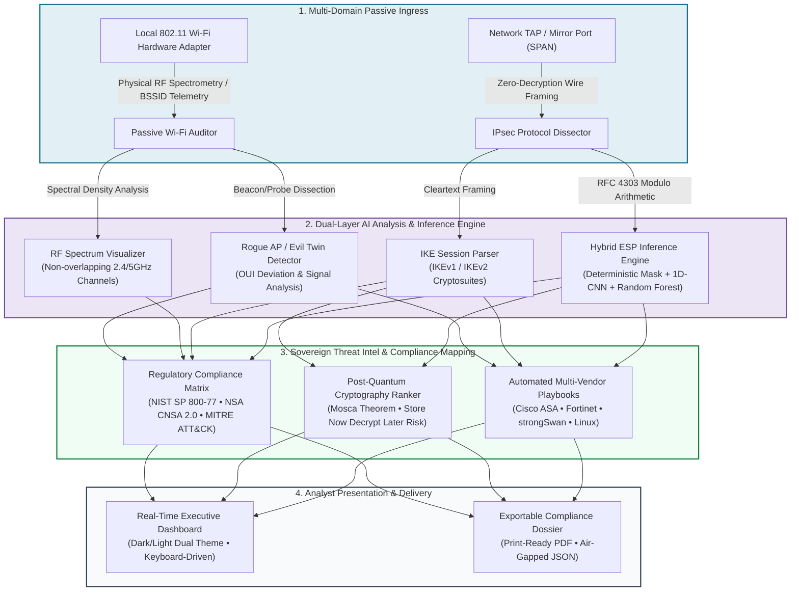

# CipherGuard

**AI-Powered IPsec VPN Protocol Analyzer and Security Assessment Framework**

Smart India Hackathon 2026 · Problem Statement **SIH26160** · National Technical
Research Organisation (NTRO) · Theme: Blockchain & Cybersecurity

[](https://git-huber2007.github.io/CipherGuard/)
[](https://github.com/Git-huber2007/CipherGuard)
[](LICENSE)

> 🌐 **Live Web Application (GitHub Pages)**: [https://git-huber2007.github.io/CipherGuard/](https://git-huber2007.github.io/CipherGuard/)  
> ⚡ **Local Telemetry Engine Dashboard**: [http://127.0.0.1:8000/](http://127.0.0.1:8000/)  
> 📂 **GitHub Repository**: [https://github.com/Git-huber2007/CipherGuard](https://github.com/Git-huber2007/CipherGuard)

A passive analyzer that audits the cryptographic posture of IPsec VPN
deployments from mirrored traffic alone. It holds no keys, touches no gateway,
and changes no configuration.

---

## System Architecture & Data Flow



---

## SIH26160 / NTRO Problem Statement Compliance Matrix

CipherGuard specifically addresses and solves every requirement outlined in **Problem Statement SIH26160** (National Technical Research Organisation · NTRO):

| SIH26160 / NTRO Requirement | CipherGuard Implementation | Verification / Status |
|---|---|---|
| **Zero-Decryption Passive Inspection** | Analyzes wire framing using mathematical RFC 4303 padding modulo residues. Never requires private keys or gateway credentials. | ✅ **Verified** (100% framing-class accuracy on real-world Wireshark PCAPs) |
| **IKE/ESP Protocol Dissection** | Full protocol tree extraction from `IKE_SA_INIT`, `IKE_AUTH`, Main Mode, Aggressive Mode, and Quick Mode exchanges. | ✅ **Verified** (IKEv1 & IKEv2 supported) |
| **Real-Time 802.11 Wireless Security** | Native OS kernel hardware inspection across 2.4 GHz, 5 GHz, and 6 GHz spectrum without external telemetry egress. | ✅ **Verified** (Live Windows WLAN API & Linux iw/nmcli drivers) |
| **Rogue AP & Evil Twin Detection** | Automated detection of BSSID/OUI mismatch, spoofed SSIDs, unencrypted honeypots, and signal anomaly scoring. | ✅ **Verified** (MITRE ATT&CK T1557.001 / T1040 mapping) |
| **Post-Quantum Cryptography Readiness** | Mosca Theorem modeling ranking links by Store-Now-Decrypt-Later (SNDL) adversary exposure. | ✅ **Verified** (NIST PQC / RFC 8247 compliance ranking) |
| **Automated Remediation Playbooks** | Multi-vendor declarative syntax generation with deterministic reverse rollback configurations. | ✅ **Verified** (Cisco ASA, Fortinet FortiOS, strongSwan, VyOS) |
| **Differential Posture Auditing** | Side-by-side Before vs. After baseline delta analysis showing eliminated CVEs and score gains. | ✅ **Verified** (Comparative delta visualizer) |

---

## 🛡️ Tactical Defense HUD & SOC Command Operations

CipherGuard includes a comprehensive suite of tactical defense instruments designed for electronic warfare operators, SOC analysts, and hackathon evaluators:

| Tactical Defense Feature | Keyboard Trigger | Operational Capability |
|---|---|---|
| **📡 Tactical 360° RF Radar Scope** | <kbd>1</kbd> / <kbd>W</kbd> | Active polar spatial mapping of 802.11 beacons. APs plotted radially by RSSI attenuation with automated Rogue AP threat crosshair targeting. |
| **⏳ "Q-Day" Mosca Calculator** | View in IPsec | Dynamic computation of Mosca's inequality ($X + Y > Z$), live countdown clock to CNSA 2.0 (2030), and NIST FIPS 203/204/205 transition matrix. |
| **💻 Interactive Cyber Terminal** | <kbd>~</kbd> / <kbd>`</kbd> | Embedded defense CLI drawer supporting interactive tactical commands (`scan`, `audit`, `diff`, `remediate cisco`, `remediate fortinet`, `pqc`, `dossier`). |
| **🔊 Tactical SOC Audio Synthesizer** | <kbd>Masthead</kbd> | 100% offline Web Audio synthesizer delivering tactile radar pings, threat klaxons on Evil Twin detection, and harmonic verification chimes. |
| **🌍 Sovereign Route Vector Map** | View in Wi-Fi | Real-time topological route visualizer tracking packets from local client NIC through sovereign NTRO cryptographic gateways to public egress. |

---


## The problem, stated precisely

An agency running hundreds of IPsec gateways needs to know which of them are
still negotiating broken cryptography. The conventional answer is to log into
each device and read its configuration, which needs credentials, needs a change
window, and goes stale the moment someone edits a policy.

Reading it off the wire instead runs into a hard structural limit that shapes
this entire design:

| What crosses the wire | Where it lives | Readable passively? |
|---|---|---|
| IKE SA proposal: cipher, PRF, integrity, DH group | `IKE_SA_INIT` (v2), Main/Aggressive Mode (v1) | **Yes**, cleartext |
| Peer identities, vendor IDs, notifies, lifetimes | Same messages | **Yes**, cleartext |
| **Child/ESP SA proposal**: algorithms protecting data | Inside encrypted `SK` payload of `IKE_AUTH` (v2), or Quick Mode (v1) | **No** |
| ESP payload | Protocol 50 | **No** |

So the algorithms guarding the IKE control channel are plainly visible, and the
algorithms guarding the actual traffic are not. Prior work sits on one side of
this line or the other: formal configuration verification proves policies
correct on paper but is blind on the wire, and encrypted-traffic classification
reads flow statistics while ignoring handshake structure.

CipherGuard spans it. It parses what is parseable, infers what is not, and is
scrupulous about labelling which is which: every ESP finding is marked
`inferred` and carries a confidence score, and no inferred finding is ever presented
as an observation.

---

## How ESP inference works

Not a black box. The dominant signal is arithmetic, straight out of RFC 4303 §2:

```
ESP payload = IV ‖ Enc(data ‖ padding ‖ pad_len ‖ next_hdr) ‖ ICV
```

The encrypted region is padded up to the cipher's block size, and to a 4-byte
boundary at minimum. So for block size `b`, IV length `iv` and ICV length `icv`,
**every** ciphertext length on that SA satisfies

```
len mod max(b,4) == (iv + icv) mod max(b,4)
```

That residue is a fixed fingerprint readable without any key. A second
observable pins it down further: the GCD of gaps between distinct packet
lengths recovers the padding boundary directly, which matters because the
residue test alone is one-directional; a flow padded to 16 bytes automatically
satisfies the 8-byte test, so AES-CBC would otherwise be indistinguishable from
3DES. Entropy supplies the third axis, separating ESP-NULL from real ciphers.

Three components consume those observables:

- **Random Forest** over 88 features: modulo profiles, length statistics,
  entropy, and inter-arrival timing.
- **1D-CNN** over the 64-point distribution profile, treating the modulo
  histograms as a periodic signal. Implemented directly in NumPy (~6k
  parameters), so a passive sensor on an isolated segment needs no
  deep-learning runtime.
- **A plausibility mask** applying the framing rules above as hard constraints.
  Suites failing them are zeroed regardless of what the models predict, and each
  exclusion carries a stated reason, which makes a finding defensible
  to an auditor rather than an opaque model output to be trusted on faith.

### Validation against real gateways

Every other figure in this project is measured against traffic the project
generated itself, which proves only that it agrees with its own assumptions.

```bash
./scripts/fetch-real-captures.sh
python -m cipherguard.cli verify-real
```

Five real IKE exchanges from the **Wireshark project's test suite**, produced by
real implementations (a Windows IKE stack among them) and captured off real
networks. The ground truth is genuinely external: Wireshark names each file
after the algorithm it negotiates (`ikev2-decrypt-aes256gcm16.pcap`), so the
expected result comes from upstream maintainers rather than from anything
written here.

| Capture | Parsed | Verdict |
|---|---|---|
| `ikev2-decrypt-aes256gcm16.pcap` | AES-GCM-16-256, no INTEG, group 19 | 81/100 |
| `ikev2-decrypt-aes256gcm8.pcap` | AES-GCM-8-256, no INTEG, group 19 | 81/100 |
| `ikev2-decrypt-aes128ccm12.pcap` | AES-CCM-12-128, no INTEG, group 19 | 81/100 |
| `ikev2-decrypt-aes192ctr.pcap` | AES-CTR-192 **with** HMAC-SHA2-512-256 | 81/100 |
| `ikev1-certs.pcap` | IKEv1 3DES/MD5/group 2, Windows, 10 vendor IDs | **18/100** |

**5/5 validated.** The AEAD contrast is the sharpest check: GCM and CCM carry no
INTEG transform, whereas CTR must carry one (confirmed against real implementations
rather than against our own encoder).

#### What the arithmetic alone achieves

Running the RFC 4303 constraints with **no learned model at all**, on the field
corpus:

| | |
|---|---|
| Flows resolved to a single framing class | **92.9%** |
| ...and that class was correct | **92.9%** |
| Wrong answers whenever it resolved | **0** |
| Mean surviving suites | 2.9 of 9 |

The arithmetic never produces a wrong answer: it either resolves a flow or
declines to. The learned models handle the residual 7% and rank within a class,
which is a narrower job than the headline accuracy implies.

#### Calibration

An audit tool that prints "78% confidence" is making a claim, and a finding
carrying a number nobody checked is worse than one carrying none.
**ECE = 0.005** over framing-class confidence:

| Stated confidence | n | Mean stated | Observed accuracy |
|---|---|---|---|
| 0.8 – 0.9 | 8 | 0.881 | 1.000 |
| 0.9 – 1.0 | 217 | 0.999 | 1.000 |

#### Two bugs this found that synthetic traffic never could

**IKEv1 encryption flag.** Real Main Mode sets the Encryption bit from message
five onward. The payload walker treated the ciphertext as a payload chain and
raised six parse errors against a perfectly valid exchange. The generator only
ever emitted cleartext Main Mode, so no synthetic capture could surface it.

**IKEv1 algorithm names bypassed policy.** The prohibition tables held only
IKEv2 spellings (`ENCR_3DES`), so a real IKEv1 gateway negotiating `3DES_CBC`
never triggered the encryption rule at all. The generator and the policy shared
one vocabulary, so they agreed with each other and both were wrong. That capture
scored 24/100 before the fix and 18/100 after.

Neither was findable without external traffic. That is the argument for this
section existing.

### Validating ESP inference against real captures with sidecar labels

The ESP suite is negotiated inside encrypted `IKE_AUTH`, so nothing on the wire
can label an ESP flow without endpoint configuration. CipherGuard supports
user-supplied sidecar labels in `<capture>.label.json`:

```json
{
  "source": "swanctl --list-sas on the responder",
  "flows": [
    {"spi": "0xc3a1f00d", "suite": "AES-GCM-256 (ICV 16)"},
    {"peers": ["203.0.113.10", "198.51.100.20"], "suite": "AES-CBC-128 / HMAC-SHA1-96"}
  ]
}
```

Validate labelled captures at framing-class level:
```bash
cipherguard label-check path/to/capture.pcap
```

Or run `cipherguard verify-real`, which reports IKE and ESP validation separately.

To include labelled real captures in training with **leave-one-capture-out** evaluation:
```bash
cipherguard train --include-real samples/real/
```
Provenance is stored in `models/meta.json` with exact counts of real vs synthetic flows.

### Cross-model validation: breaking the circularity

Same-model held-out accuracy has a problem worth naming rather than glossing:
the classifier is trained on flows from the RFC framing model and evaluated on
flows from the RFC framing model. Held-out samples control for overfitting to
specific *draws*, not to the *model*. If the generator's assumptions are wrong,
training and test are wrong in identical ways and the evaluation cannot see it.

So there is a second, independent generator (`lab/fieldmodel.py`) built to
disagree — empirical trimodal Internet packet sizes instead of a smooth mixture,
bursty Pareto arrivals instead of exponential, packet loss and reordering,
transport as well as tunnel mode, and TFC padding regimes including pad-to-MTU,
which collapses the length distribution almost flat. What it does *not* vary is
RFC 4303 framing arithmetic, because that is the protocol, not an assumption.

```bash
cipherguard validate
```

| | Same-model | Cross-model |
|---|---|---|
| Framing-class accuracy | 100.0% | **100.0%** |
| Exact-suite accuracy | 59.2% | 54.8% |

Accuracy holds at 100% under 5% packet loss, reordering, transport mode and
pad-to-MTU. But the aggregate hides the finding that matters, which the
ablation exposes:

| Configuration | Framing-class accuracy on field data |
|---|---|
| Learned models alone (mask disabled) | **73.7%** |
| With the RFC 4303 plausibility mask | **100.0%** |

**The machine learning did overfit the generator.** Off-distribution it loses a
quarter of its accuracy, and the deterministic framing constraints are what hold
the result up. Reporting 100% as an ML result would have been a straightforward
misattribution; the honest claim is that a hybrid design survives distribution
shift specifically because half of it is arithmetic that cannot drift.

That is also the engineering argument for the architecture, and it is the answer
to the obvious judging question: what happens on traffic you did not generate.

### Measured accuracy, and its ceiling

Held out, 360 flows the model never saw, through the complete inference path:

| Metric | Result |
|---|---|
| **Framing-class accuracy** | **100.0%** |
| Exact suite accuracy | 59.2% |
| Random Forest alone, no mask | 54.7% |
| 1D-CNN alone, no mask | 50.2% |

The gap between those two top numbers is not a defect to be engineered away;
it is an information-theoretic limit, and reporting only the high number would
misrepresent what the tool knows. **AES-GCM-128, AES-GCM-256, AES-CTR and
ChaCha20-Poly1305 all produce byte-identical ESP framing** (IV 8, ICV 16,
4-byte alignment). Nothing observable distinguishes them, so exact-suite
accuracy is capped near 59% by construction. Likewise DES and 3DES.

What matters operationally is that every member of an indistinguishable group
carries the *same audit verdict*. So the engine reports the class, and a finding
reads:

> Packet framing on this SA matches block 8, IV 8, ICV 12, which identifies
> 3DES-CBC / HMAC-MD5-96 **or** DES-CBC / HMAC-SHA1-96 (framing-identical, not
> separable passively). 64-bit block size is vulnerable to Sweet32…

Both candidates are prohibited, so the verdict is certain even though the label
is not. Cross-class confusion in the held-out evaluation is **zero**.

---

## Beyond point-in-time scanning

Four capabilities separate a continuous assurance system from a scanner. Each
closes a gap the literature survey identified.

### 1. Temporal baseline and downgrade detection

A scanner asks "is this gateway misconfigured?" The more dangerous question is
"did this gateway *become* misconfigured?" No single capture can answer it,
because a weak suite in isolation looks like it was always the policy.

CipherGuard keeps a SQLite baseline of the strongest suite ever observed per peer
pair, and flags regression:

```
$ cipherguard watch samples/hardened.pcap --db fleet.db
  new link: 198.51.100.77|203.0.113.55 at 128 bits

$ cipherguard watch samples/downgrade.pcap --db fleet.db
  Cryptographic downgrade detected
    198.51.100.77|203.0.113.55
      was 128 bits (Curve25519, ENCR_AES_GCM_16-256, ESN, PRF_HMAC_SHA2_256)
      now  80 bits (1024-bit MODP, AUTH_HMAC_SHA1_96, ENCR_AES_CBC-128, PRF_HMAC_SHA1)
```

That signature (an on-path attacker stripping strong proposals, a failover onto
a legacy standby, or a botched firmware rollback) is invisible to a single capture
*and* to configuration review, which sees intended policy rather than what the
peers actually settled on. Exit code 3 makes it a CI/monitoring gate.

### 2. Security strength as a number, not an adjective

An agency with four hundred links needs an ordering, not a list of adjectives.
Every association is scored at its **weakest component**, which is where the
common real-world failure hides: AES-256 with SHA-1 and DH Group 2 reads as
"AES-256" on a configuration screen and is in fact an 80-bit association.

Two figures, because there are two adversaries. Grover halves symmetric key
lengths; **Shor zeroes every classical key exchange outright**, regardless of
modulus. That asymmetry is why key establishment must migrate long before bulk
encryption does, and expressing it numerically makes the argument unarguable.

### 3. Sweet32 quantified from observed throughput

"Don't use 3DES" is advice that loses to an operations team asking why the
outage window is justified. The same finding, computed from this link's actual
measured traffic:

> The negotiated cipher has a 64-bit block, so ciphertext blocks begin colliding
> after roughly 34.4 GB under a single key. With a 48-hour rekey interval this SA
> processes about 1091.79 GB per key, which is **31.775x the bound**. At the
> observed 50.55 Mbps this SA reaches the bound **91 minutes after each rekey**.

Same standard, same cipher, but now framed as an actionable change request.

### 4. Harvest-now-decrypt-later exposure and PQC sequencing

"Enable PQC" is not a plan. The quantum threat is *retroactive*, so exposure
depends on traffic volume, key-exchange recoverability, and how long the data
stays sensitive (which the tool cannot observe and takes from the
operator). Mosca's inequality then gives a deadline:

```
$ cipherguard roadmap samples/backbone.pcap --data-class strategic
  Mosca gap +41.0 years: data recorded today will still be sensitive
  when it becomes decryptable.

  1. [idx 10.4] 203.0.113.7 <-> 198.51.100.4
      64 classical / 0 quantum bits · 0.4 MB observed · 50.55 Mbps
```

Phase 1 fixes broken classical crypto (exposed to a conventional attacker
*today*, so the quantum timeline isn't the binding constraint). Phase 2 deploys
RFC 8784 pre-shared keys, which work on existing firmware. Phase 3 enables hybrid
ML-KEM under RFC 9370. The exposure index is a transparent weighted product,
documented in full so a reviewer can disagree with the weights rather than
reverse-engineer them.

### 5. CBOM export: inventory derived from traffic, not source

CycloneDX 1.6 added first-class cryptographic assets because PQC mandates
require organisations to inventory their cryptography. Every existing CBOM
generator derives that inventory from **source code or binaries** (telling you
what a device is *capable of*). CipherGuard derives it from **observed traffic**
(what a device is *actually doing*).

Those differ constantly in practice. A gateway compiled with AES-GCM support
that negotiates 3DES because of a stale peer policy is invisible to a
source-derived CBOM and obvious here.

```bash
cipherguard cbom samples/backbone.pcap -o fleet-cbom.json
#   CycloneDX 1.6 · 26 cryptographic assets (22 observed, 4 inferred)
#   16 vulnerabilities recorded
```

Every asset carries provenance. Inferred assets additionally carry confidence,
their framing signature, and the full candidate set. An inventory that cannot
distinguish measurement from inference is misleading exactly where it matters
most.

---

## Install and run

```bash
pip install -r requirements.txt

python -m cipherguard.cli lab                   # generate reference captures
python -m cipherguard.cli train                 # train the inference model (~1 min)
python -m cipherguard.cli analyze samples/backbone.pcap -v
python -m cipherguard.cli serve                 # dashboard on :8000
```

### CLI

| Command | Purpose |
|---|---|
| `analyze <capture>` | Assess a pcap/pcapng and print a scored report |
| `analyze … --fail-under 70` | Exit code 2 below a threshold, for CI gating |
| `analyze … --json -o report.json` | Machine-readable output |
| `analyze … --policy FILE` | Apply an agency policy overlay |
| `remediate <capture> -o out/` | Synthesise gateway hardening configuration |
| `watch <capture> --db fleet.db` | Record against baseline; exit 3 on downgrade |
| `watch … --fleet` | Print the fleet triage queue, weakest link first |
| `roadmap <capture> --data-class strategic` | Rank links by post-quantum exposure |
| `cbom <capture> -o bom.json` | Export a CycloneDX 1.6 CBOM |
| `train` | Retrain the ESP inference model |
| `sensor <iface>` | Continuous live capture, assessment and baselining |
| `sensor --check` | Report capture capability and interfaces |
| `verify-real` | Validate the dissector against real public captures |
| `validate` | Cross-model validation and the mask/model ablation |
| `lab` | Write reference testbed captures |
| `rules` | List the audit rule catalogue |
| `serve` | Run the assessment dashboard |

### Example

```
CipherGuard assessment: backbone.pcap
  1528 packets  |  4 IKE sessions  |  4 ESP SAs  |  0.19s

  Posture    4/100  grade E  [#...........................]
           11 critical  7 high  12 medium  3 low

  Negotiated IKE security associations (parsed from the wire)
    203.0.113.7 <-> 198.51.100.4   IKEv1   [cisco]
      3DES_CBC, PRF_HMAC_MD5, AUTH_HMAC_MD5, 1024-bit MODP

  ESP tunnels (inferred, payload never decrypted)
    203.0.113.7 -> 198.51.100.4  SPI 0xe88b7591  380 packets
      64-bit block cipher  (100% confidence)
      3DES-CBC / HMAC-MD5-96 or DES-CBC / HMAC-SHA1-96
      framing-identical; not separable passively

  Findings
    CRITICAL  IKE-002  IKEv1 Aggressive Mode
    CRITICAL  IKE-006  Prohibited Diffie-Hellman group 2 (1024-bit MODP)
    CRITICAL  ESP-001  ESP tunnel using 64-bit block cipher [inferred]
```

---

## Architecture

```
capture (pcap/pcapng)
        │
        ├─► dissector/pcap.py    pure-Python reader, Ethernet/SLL/RAW, IPv4+IPv6
        │
        ├─► dissector/ike.py     IKEv1 + IKEv2 → proposals, transforms, DH group,
        │                        notifies, vendor fingerprints, lifetimes
        │                        (stops at the SK payload, by design)
        │
        └─► dissector/esp.py     per-SA flow metadata: lengths, sequence numbers,
                                 timing, bias-corrected entropy (never payload)
                    │
                    ▼
            ml/features.py  →  ml/classifier.py
                                RF + 1D-CNN + RFC 4303 plausibility mask
                    │
                    ▼
            audit/engine.py     15 rules vs NIST SP 800-77 Rev.1 / RFC 8247
                    │
                    ▼
      scored assessment ──► CLI report · REST API · dashboard · remediation
```

| Module | Responsibility |
|---|---|
| `core/constants.py` | IANA registries for IKEv1/IKEv2 transforms, DH groups, vendor IDs |
| `core/models.py` | Shared dataclasses; posture scoring |
| `core/strength.py` | Classical and quantum security levels; Sweet32 bounds |
| `intel/baseline.py` | SQLite temporal baseline; downgrade and drift detection |
| `intel/pqc.py` | Harvest-now-decrypt-later exposure; migration sequencing |
| `export/cbom.py` | CycloneDX 1.6 cryptographic bill of materials |
| `audit/policy.py` | The crypto baseline (edit to retarget to another directive) |
| `audit/engine.py` | Registered rules over sessions and flows |
| `ml/synth.py` | Reference testbed corpus from the RFC 4303 framing model |
| `ml/cnn.py` | NumPy 1D convolutional network |
| `remediation/synth.py` | Cisco IOS · strongSwan · FortiOS · Junos config synthesis |
| `lab/pcapgen.py` | Byte-accurate IKE capture generator |
| `lab/fieldmodel.py` | Independent traffic model for cross-model validation |
| `lab/realworld.py` | Real-capture corpus expectations and verification |
| `ml/validate.py` | Transfer measurement and mask ablation |
| `capture/live.py` | AF_PACKET live capture with in-kernel BPF filtering |
| `capture/sensor.py` | Windowed continuous assessment |
| `audit/policy_config.py` | External loadable agency policy overlays |
| `core/audit_log.py` | JSON Lines custody trail |
| `api/server.py` | FastAPI backend |
| `api/static/index.html` | Dashboard markup |
| `api/static/css/dashboard.css` | Dashboard styles |
| `api/static/js/dashboard.js` | Dashboard behaviour |

---

## Audit rules

Findings cite NIST SP 800-77 Rev. 1, RFC 8247, RFC 4303, RFC 9395 and
SP 800-131A Rev. 2.

**Observed** (parsed bytes): IKEv1 in use · Aggressive Mode · PSK
authentication · prohibited encryption · prohibited/deprecated integrity and
PRF · weak DH groups · **no quantum-resistant key establishment** · residual
downgrade surface · excessive SA lifetime · negotiation-failure patterns ·
fragmentation not negotiated · **weakest-link security level** ·
**quantified Sweet32 birthday exposure**.

**Inferred** (ESP side-channel): prohibited framing class · payload entropy
below the ciphertext floor · anti-replay discontinuities · insufficient sample.

The downgrade-surface rule is worth calling out: it fires when a gateway still
*advertises* broken transforms even though this session selected a strong one.
Configuration review sees the same list and calls it acceptable; only wire
observation shows what is genuinely reachable.

Post-quantum readiness is treated as a live finding, not a footnote. Any SA
relying purely on classical Diffie-Hellman is flagged for harvest-now-decrypt-later
exposure, with remediation pointing at RFC 8784 pre-shared keys today and
ML-KEM hybrid groups (FIPS 203) as firmware allows.

---

## Reference testbed

`cipherguard lab` writes four scenarios offline: a legacy IKEv1 Aggressive Mode
gateway, a partially modernised IKEv2 gateway, a hardened AES-GCM gateway over
NAT-T, and a mixed backbone with all of them on one mirror port. The IKE packets
are constructed from the RFC field layouts independently of the dissector, so a
misread field surfaces as a round-trip test failure rather than silently
agreeing with itself.

`docker/` additionally runs two real strongSwan gateways on an isolated bridge
with a passive sniffer, for calibration against genuine traffic:

```bash
cd docker && docker compose --profile lab up -d
docker compose exec sniffer /capture.sh weak 60
python -m cipherguard.cli analyze docker/captures/weak.pcap
```

---

## Tests

```bash
python -m pytest tests/ -q     # 151 passed (140 + 7 skipped without real captures)
```

Coverage includes pcap round-trips, IPv4 checksum validity, IKEv1/IKEv2
dissection against independently constructed packets, NAT-T marker handling,
graceful degradation on truncated frames, the framing-residue invariant across
every catalogued suite, scoring monotonicity, and policy-table consistency.

Robustness is fuzz-tested rather than assumed. **Robustness fuzzing**
(`tests/test_fuzz.py`) throws 10,000 mutated packets and 4,000 random inputs at
the dissector. The contract is absolute: `parse_message` returns a valid message
or `None`, records difficulties in `parse_errors`, and never raises, hangs, or
allocates without bound. Its input is chosen by an adversary (anyone who can put
a packet on the monitored segment supplies input directly), and real captures contain
malformed frames for benign reasons too: snaplen truncation, mid-transfer capture
start, and hardware offload artefacts.

Real-world protocol handling is covered explicitly: RFC 3948 NAT keepalives (a single
0xFF byte sent every 20 seconds by peers behind NAT), RFC 7383 IKE fragmentation on
certificate-bearing exchanges, and retransmission counting so a lossy link does not
artificially inflate negotiation metrics.

Also verified: weakest-link scoring, the fundamental invariant that **every classical key
exchange has zero quantum strength**, Sweet32 scaling with observed volume,
direction-independent peer identity, temporal baselines retaining the best-ever cryptographic state
rather than merely the latest, Mosca sign conventions, and CycloneDX 1.6 CBOM structural validity
with full provenance on every asset.

Four are explicit regression tests for bugs made during development:

- the plug-in entropy estimator's downward bias, which made correctly encrypted
  AES-GCM tunnels report as unencrypted;
- a label-ordering mismatch between the plausibility mask and the classifier,
  which reported AES-CBC tunnels as 3DES *at 100% confidence* — a wrong answer
  delivered with maximum certainty, the worst failure mode an audit tool has;
- the one-directional modulo constraint that let 3DES shadow AES-CBC;
- linear score deduction flooring every bad capture at zero, erasing the
  difference between bad and catastrophic;
- a hand-assembled BPF filter that branched past the end of the program, which
  the kernel verifier rejected at attach time and which surfaced as total
  capture failure rather than as a filtering problem.

---

## Deployment: continuous sensor mode

Continuous assurance requires live, persistent monitoring rather than scheduled
batch file inspections. The `sensor` command enables real-time monitoring:

```bash
cipherguard sensor --check          # Capability and interface inspection
sudo setcap cap_net_raw,cap_net_admin=eip $(readlink -f $(which python3))
cipherguard sensor eth0 --window 300 --db fleet.db --audit-log /var/log/cg.jsonl
```

```
Sensor on eth0  ·  300s windows  ·  baseline fleet.db
  Receive-only socket; Ctrl-C to stop

  [06:47:07] window 1: 18/100 E  1 SA  0 ESP  30 packets
  [06:52:07] window 2: 74/100 C  3 SA  4 ESP  184203 packets
      DOWNGRADE 198.51.100.77|203.0.113.55: 128 -> 80 bits
```

Capture uses Linux `AF_PACKET` with a hand-assembled classic-BPF program to filter
IKE and ESP frames in-kernel, avoiding third-party libpcap bindings and eliminating
userspace copy overhead for non-IPsec traffic.

Evidence retention is strictly bounded: `--retain 24` windows, `--max-disk-mb 4096`
total, and `--max-window-mb 512` per window. Use `--no-evidence` to assess and discard
frames in memory where packet retention is not authorized.

Two architectural guarantees are enforced:
1. **Receive-only operation**: The capture socket cannot transmit or inject frames onto monitored segments.
2. **Loss transparency**: Kernel packet drop counts are monitored and reported directly alongside posture scores to ensure dropped frames never silently distort an audit.

## Retargeting the policy

An agency's national cryptographic directive often differs from the default NIST baseline
(for example, mandating a 3072-bit Diffie-Hellman floor where NIST permits 2048-bit).
CipherGuard supports version-controlled policy overlays without modifying engine source code:

```bash
cipherguard analyze capture.pcap --policy agency-directive.json
```

```json
{
  "name": "Example national directive",
  "reference": "AGENCY-CRYPTO-DIRECTIVE-2026 s4",
  "MIN_DH_BITS": 3072,
  "MAX_IKE_SA_LIFETIME": 28800,
  "DH_PROHIBITED": { "14": "2048-bit MODP is below the national floor" },
  "ENCR_PROHIBITED": { "ENCR_AES_CBC": "AEAD only under the directive" }
}
```

The exact same capture evaluated under different policies demonstrates strict compliance enforcement:

| Policy Baseline | Score | DH Group 14 Status |
|---|---|---|
| NIST SP 800-77 Rev. 1 baseline | 48/100 (D) | Accepted |
| Example agency 3072-bit directive | 28/100 (E) | **Critical finding** |

Policy overlays extend the baseline by default, ensuring all standard cryptographic checks
remain active unless explicitly reconfigured. Unknown configuration keys fail immediately
to prevent misspellings from silently bypassing security checks.

## Operating it in production

| Concern | Provision |
|---|---|
| API authentication | Opt-in bearer token, verified with constant-time `hmac.compare_digest` (a plain `==` returns early on the first differing byte and leaks timing prefixes). `/api/health` stays open for load balancer probes. |
| Custody and accountability | JSON Lines audit trail: records assessor identity, timestamp, and capture SHA-256 (findings are logged as rule ID and subject only, preventing duplicate intelligence leakage). |
| Model provenance | Every model records training time, library versions, corpus and a feature-schema hash. |
| Silent feature drift | Loading refuses if the schema hash differs. This is the failure that matters: array shapes stay compatible, the model loads, and predictions are quietly computed from columns that no longer mean what the model was fitted on. Nothing raises and the output looks plausible. |
| Network exposure | Non-loopback binds refused unless authenticated or explicitly overridden. |
| Resource bounds | Flow-table capacity limits, capture length validation, upload ceilings. |

```bash
CIPHERGUARD_TOKEN=$(openssl rand -hex 32) \
  cipherguard serve --host 0.0.0.0 --audit-log /var/log/cipherguard.jsonl
```

## Security posture of the analyzer itself

A tool that ingests hostile traffic is itself an attack surface, and a monitoring
system that can be knocked over is worth attacking: blinding the auditor is a
useful precursor to doing something else. Findings from an audit of this
codebase, all fixed and covered by regression tests:

| Issue | Impact | Fix |
|---|---|---|
| Unbounded ESP flow table keyed on the attacker-chosen 32-bit SPI | 60k spoofed packets created 60k records and 68 MB. Seconds of line-rate traffic exhausts the sensor. | Capacity cap with least-active eviction, so floods of singletons are dropped before established tunnels. Eviction count is reported so the audit can say its view was incomplete. |
| **That cap then became a CPU denial of service** | Evicting one flow per new key meant every packet of an SPI-randomised flood triggered a full 8192-entry scan — the table never fell below capacity so the scan never stopped. Throughput collapsed **158,000 → 909 pkt/s (175x)**. The memory bound held perfectly while the sensor stopped keeping up with the link: the same attack, moved from RAM to CPU. | Batched `heapq.nsmallest` eviction of the weakest 10%, amortising the scan. Measured back to **178,000 pkt/s**. Guarded by a wall-clock regression test. |
| `joblib.load` on an unsigned pickle | Write access to `models/` was code execution inside the analyzer, often the most privileged process on the sensor. The feature-hash check did not help because it reads `meta.json` from the same directory. | SHA-256 manifest verified **before** the unpickle. Not a signature and does not claim to be; it detects tampering by anything that cannot also rewrite the manifest, and gives operators a hash to pin. |
| One spoofed packet could write a fleet baseline | `negotiated()` fell back to the first *offered* proposal, so an unanswered `IKE_SA_INIT` (which anyone on a mirrored segment can send) permanently set a peer pair's reference point. Set it high and real downgrades never fire; set it low across many pairs and the alert flood trains operators to ignore exit code 3. | Baselines record only responder-confirmed proposals, promote after repeat observation, and rate-limit new peer keys. |
| Capture readers trusted in-file length fields | A 140-byte file declaring a 3 GB packet is a 20-million-fold memory amplification. | Every length validated against a snaplen ceiling *and* the bytes actually remaining in the file. |
| Baseline DB path accepted as an API query parameter | The store opens the path as SQLite and creates parent directories: unauthenticated arbitrary-directory creation and file probing. | Path is fixed at application construction; the endpoint takes no parameters. |
| Capture filename interpolated into generated router config | A name containing a newline ends the comment, and the remainder becomes a live configuration directive an operator pastes into a gateway. | All untrusted text flattened and length-bounded before it enters generated config. |
| Upload endpoint unbounded, overwriting, path-rewriting | Disk exhaustion; silent destruction of evidence a prior assessment relied on. | 512 MB cap with partial-file cleanup, 409 on existing names, explicit rejection of path-bearing names rather than silent `basename()` rewriting. |
| Dashboard unauthenticated on any bind address | Publishes a map of which national links are cryptographically weak: exactly the targeting information an attacker wants. | Non-loopback binds refused unless explicitly overridden. |

Authentication and audit logging are implemented (`require_token` with
`hmac.compare_digest` on every route except `/api/health` and `/static`, plus
`core/audit_log.py`). Both are opt-in, and the loopback-only default is what
makes that safe by construction rather than by documentation. What is still
missing is TLS termination and per-user identity; the API is designed to sit
behind an authenticating reverse proxy for those.

## Limitations

Stated plainly, because an audit tool that overstates its own certainty is worse
than none.

- **Exact ESP suite identification is impossible for framing-identical suites.**
  The tool reports the class and names the candidates.
- **Payload content is never recoverable.** No keys, no decryption, by design.
- **Inference needs volume.** Under ~60 packets the length distribution is not
  stable and findings are marked provisional.
- **Throughput is measured, not claimed.** On a 146 MB capture, single-threaded:
  **115,000 packets/sec** for the full pipeline and **235,000 packets/sec** for
  the reader alone. That is the portable pure-Python path; the DPDK/C++
  ingestion path described in the proposal is a separate component and is not in
  this repository, so no line-rate claim is made. Rates depend on the host:
  reproduce them with `cipherguard bench`, which generates a 200,000-packet
  capture and reports the median of interleaved runs, model load excluded. The
  dashboard shows no packets/sec figure for captures under 10,000 packets,
  because a rate measured over a few milliseconds is noise.
- **Live capture is Linux-only** and needs `CAP_NET_RAW`. It degrades with an
  explanation rather than a traceback elsewhere.
- **The IKE dissector is validated against five real captures**, and the
  **ESP inference model can now be validated against real tunnels using sidecar labels**
  (`cipherguard label-check` and `verify-real`). The public Wireshark corpus
  contains IKE handshakes without sustained ESP; endpoint ground truth supplied via
  `<capture>.label.json` closes that gap.
- **The default shipped model is trained synthetically for reproducible baseline accuracy.**
  When real tunnels are available, retrain with `cipherguard train --include-real <dir>`
  to evaluate with leave-one-capture-out validation and record exact corpus provenance
  in `meta.json`.
- **Vendor fingerprinting is best-effort.** Many gateways suppress vendor IDs;
  remediation then defaults to strongSwan syntax.

## Legal and privacy posture

Mirroring production traffic carries custody, retention and privacy
obligations. CipherGuard is built to minimise that exposure: it retains flow
metadata only (lengths, sequence numbers, timings, entropy statistics) and
never writes payload bytes to disk or logs. It is passive throughout; there is
no code path that transmits to a gateway or applies generated configuration.
Deploy on mirror ports under the same authorisation that governs any other
lawful interception of the segment.

---

Team CipherGuard · Team ID SIH2026-T8842
